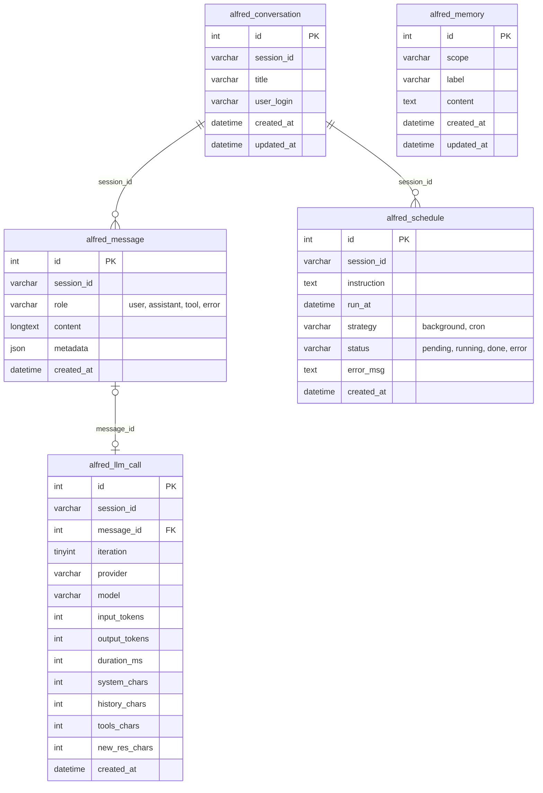

# Base de données Alfred

Alfred utilise 5 tables MySQL (préfixe `alfred_`), créées et mises à jour par le système de migrations, plus une table de suivi interne (`alfred_migration_log`).

## Diagramme entité-relation



> Les relations sont portées par `session_id` (VARCHAR) et non par des clés étrangères déclarées, conformément aux autres tables du schéma Jeedom.

## Tables

### `alfred_conversation`

Une ligne par session de chat. `session_id` est un UUID v4 généré côté PHP.

| Colonne | Type | Description |
|---|---|---|
| `id` | INT UNSIGNED | PK auto-incrément |
| `session_id` | VARCHAR(36) | UUID de la session |
| `title` | VARCHAR(255) | Titre généré automatiquement |
| `user_login` | VARCHAR(100) | Login Jeedom de l'utilisateur |
| `created_at` | DATETIME | |
| `updated_at` | DATETIME | Mis à jour à chaque nouveau message |

### `alfred_message`

Un message par ligne (utilisateur, assistant, résultat d'outil, ou erreur).

| Colonne | Type | Description |
|---|---|---|
| `id` | INT UNSIGNED | PK auto-incrément |
| `session_id` | VARCHAR(36) | Référence vers `alfred_conversation.session_id` |
| `role` | ENUM | `user`, `assistant`, `tool`, ou `error` |
| `content` | LONGTEXT | Contenu Markdown ou JSON (tool results) |
| `metadata` | JSON | Provider, model, tool calls… (structure libre) |
| `created_at` | DATETIME | |

### `alfred_llm_call`

Une ligne par appel API LLM. Dans une boucle ReAct, plusieurs appels peuvent exister pour un seul message utilisateur.

| Colonne | Type | Description |
|---|---|---|
| `id` | INT UNSIGNED | PK auto-incrément |
| `session_id` | VARCHAR(36) | Référence vers `alfred_conversation.session_id` |
| `message_id` | INT UNSIGNED | Référence vers `alfred_message.id` (nullable) |
| `iteration` | TINYINT UNSIGNED | Numéro d'itération ReAct (1, 2, 3…) |
| `provider` | VARCHAR(50) | Ex : `mistral`, `gemini`, `anthropic` |
| `model` | VARCHAR(100) | Ex : `mistral-large-2411` |
| `input_tokens` | INT UNSIGNED | Tokens d'entrée rapportés par l'API |
| `output_tokens` | INT UNSIGNED | Tokens de sortie rapportés par l'API |
| `duration_ms` | INT UNSIGNED | Durée wall-clock de l'appel API |
| `system_chars` | INT UNSIGNED | Taille du system prompt (en caractères) |
| `history_chars` | INT UNSIGNED | Taille de l'historique envoyé |
| `tools_chars` | INT UNSIGNED | Taille de la définition des outils |
| `new_res_chars` | INT UNSIGNED | Delta tool results depuis l'itération précédente |
| `created_at` | DATETIME | |

### `alfred_memory`

Mémoire persistante entre sessions, organisée par portée.

| Colonne | Type | Description |
|---|---|---|
| `id` | INT UNSIGNED | PK auto-incrément |
| `scope` | VARCHAR(100) | Portée (ex : `global`, login utilisateur) |
| `label` | VARCHAR(100) | Étiquette courte pour la recherche |
| `content` | TEXT | Contenu mémorisé |
| `created_at` | DATETIME | |
| `updated_at` | DATETIME | |

### `alfred_schedule`

Tâches différées demandées par l'utilisateur à Alfred.

| Colonne | Type | Description |
|---|---|---|
| `id` | INT UNSIGNED | PK auto-incrément |
| `session_id` | VARCHAR(36) | Session d'origine |
| `instruction` | TEXT | Instruction à exécuter |
| `run_at` | DATETIME | Date/heure d'exécution prévue |
| `strategy` | ENUM | `background` (one-shot) ou `cron` (récurrent) |
| `status` | ENUM | `pending`, `running`, `done`, `error` |
| `error_msg` | TEXT | Message d'erreur éventuel |
| `created_at` | DATETIME | |

---

## Système de migrations

### Vue d'ensemble

Les migrations sont gérées par `alfredMigration` ([core/class/alfredMigration.class.php](core/class/alfredMigration.class.php)). Chaque migration dispose d'un `up` (appliqué au déploiement) et d'un `down` (SQL de retour arrière, persisté hors git).

### Table interne : `alfred_migration_log`

Créée automatiquement au premier `runPending()`. Enregistre chaque migration appliquée.

| Colonne | Type | Description |
|---|---|---|
| `id` | INT UNSIGNED | PK auto-incrément |
| `version` | INT UNSIGNED | Numéro de migration (UNIQUE) |
| `hash` | VARCHAR(32) | md5 du SQL de rollback |
| `filename` | VARCHAR(100) | Nom du fichier down sur le Pi (ex: `V2_abc123.sql`) |
| `applied_at` | DATETIME | |

### Fichiers down (hors git)

Au moment où un `up` est appliqué, le SQL du `down` correspondant est sauvegardé dans :

```
/var/www/html/plugins/alfred/var/migrations/V{n}_{md5}.sql
```

Ce répertoire est exclu de git (`var/` dans `.gitignore`) et persiste sur le Pi indépendamment des commits. En cas de `git revert`, les fichiers down restent disponibles.

### Ajouter une migration

1. Ajouter l'entrée dans `MIGRATIONS` :
   ```php
   const MIGRATIONS = [
       1 => 'migration_001_baseline',
       2 => 'migration_002_mon_changement',  // ← nouvelle entrée
   ];
   ```

2. Écrire les méthodes `up` et `down` **ensemble** :
   ```php
   private static function migration_002_mon_changement(): void
   {
       DB::Prepare("ALTER TABLE `alfred_message` ADD COLUMN `foo` VARCHAR(50) DEFAULT NULL", [], DB::FETCH_TYPE_ROW);
   }

   private static function migration_002_mon_changement_down(): string
   {
       return "ALTER TABLE `alfred_message` DROP COLUMN `foo`";
   }
   ```

   > Le `_down` retourne une **chaîne SQL** (pas void). Il n'est pas exécuté directement — son seul rôle est de produire le fichier de rollback au moment du déploiement.

3. Déployer : `alfred_update()` appelle `runPending()`, qui applique le `up` et sauvegarde le fichier `V2_{md5}.sql`.

### Workflow de rollback

**Procédure recommandée** (avant tout `git revert`) :

```php
// Depuis un snippet PHP Jeedom ou en SSH via php -r
include_file('core', 'alfredMigration', 'class', 'alfred');
alfredMigration::rollbackTo(1);  // revient à la version 1
```

Puis seulement ensuite faire le `git revert` de la feature.

**Cas d'urgence** (git revert déjà fait) :

1. Consulter `alfred_migration_log` pour retrouver le `filename` de la version à annuler
2. Exécuter manuellement le SQL du fichier `var/migrations/V{n}_{hash}.sql`
3. Mettre à jour `schemaVersion` dans la table `config` Jeedom :
   ```sql
   UPDATE config SET value = 'N' WHERE plugin = 'alfred' AND `key` = 'schemaVersion';
   DELETE FROM alfred_migration_log WHERE version > N;
   ```
