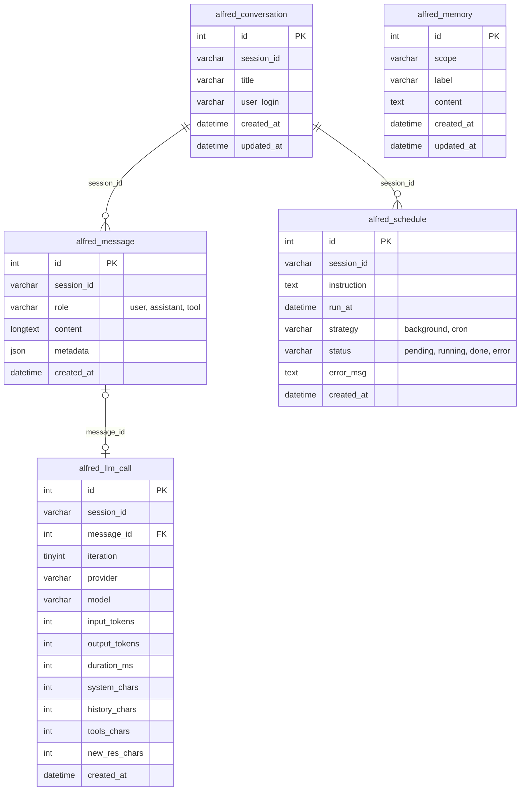

# Base de données Alfred

Alfred utilise 5 tables MySQL (préfixe `alfred_`), créées et mises à jour par le système de migrations.

## Diagramme entité-relation

> Les relations sont portées par `session_id` (VARCHAR) et non par des clés étrangères déclarées, conformément aux autres tables du schéma Jeedom.

## Tables

### `alfred_conversation`

Une ligne par session de chat. `session_id` est un UUID v4 généré côté PHP.

| Colonne | Type | Description |
|---|---|---|
| `id` | INT UNSIGNED | PK auto-incrément |
| `session_id` | VARCHAR(36) | UUID de la session |
| `title` | VARCHAR(255) | Titre généré automatiquement |
| `user_login` | VARCHAR(100) | Login Jeedom de l'utilisateur (migration #4) |
| `created_at` | DATETIME | |
| `updated_at` | DATETIME | Mis à jour à chaque nouveau message |

### `alfred_message`

Un message par ligne (utilisateur, assistant, ou résultat d'outil).

| Colonne | Type | Description |
|---|---|---|
| `id` | INT UNSIGNED | PK auto-incrément |
| `session_id` | VARCHAR(36) | Référence vers `alfred_conversation.session_id` |
| `role` | ENUM | `user`, `assistant`, ou `tool` |
| `content` | LONGTEXT | Contenu Markdown ou JSON (tool results) |
| `metadata` | JSON | Provider, model, tool calls… (structure libre) |
| `created_at` | DATETIME | |

### `alfred_llm_call` *(migration #5, PR #36)*

Une ligne par appel API LLM. Dans une boucle ReAct, plusieurs appels peuvent exister pour un seul message utilisateur.

| Colonne | Type | Description |
|---|---|---|
| `id` | INT UNSIGNED | PK auto-incrément |
| `session_id` | VARCHAR(36) | Référence vers `alfred_conversation.session_id` |
| `message_id` | INT UNSIGNED | Référence vers `alfred_message.id` (nullable) |
| `iteration` | TINYINT UNSIGNED | Numéro d'itération ReAct (1, 2, 3…) |
| `provider` | VARCHAR(50) | Ex : `mistral`, `gemini`, `anthropic` |
| `model` | VARCHAR(100) | Ex : `mistral-large-2411` |
| `input_tokens` | INT UNSIGNED | Tokens d'entrée rapportés par l'API |
| `output_tokens` | INT UNSIGNED | Tokens de sortie rapportés par l'API |
| `duration_ms` | INT UNSIGNED | Durée wall-clock de l'appel API |
| `system_chars` | INT UNSIGNED | Taille du system prompt (en caractères) |
| `history_chars` | INT UNSIGNED | Taille de l'historique envoyé |
| `tools_chars` | INT UNSIGNED | Taille de la définition des outils |
| `new_res_chars` | INT UNSIGNED | Delta tool results depuis l'itération précédente |
| `created_at` | DATETIME | |

### `alfred_memory`

Mémoire persistante entre sessions, organisée par portée.

| Colonne | Type | Description |
|---|---|---|
| `id` | INT UNSIGNED | PK auto-incrément |
| `scope` | VARCHAR(100) | Portée (ex : `global`, login utilisateur) |
| `label` | VARCHAR(100) | Étiquette courte pour la recherche (migration #2) |
| `content` | TEXT | Contenu mémorisé |
| `created_at` | DATETIME | |
| `updated_at` | DATETIME | |

### `alfred_schedule`

Tâches différées demandées par l'utilisateur à Alfred.

| Colonne | Type | Description |
|---|---|---|
| `id` | INT UNSIGNED | PK auto-incrément |
| `session_id` | VARCHAR(36) | Session d'origine |
| `instruction` | TEXT | Instruction à exécuter |
| `run_at` | DATETIME | Date/heure d'exécution prévue |
| `strategy` | ENUM | `background` (one-shot) ou `cron` (récurrent) |
| `status` | ENUM | `pending`, `running`, `done`, `error` |
| `error_msg` | TEXT | Message d'erreur éventuel |
| `created_at` | DATETIME | |
